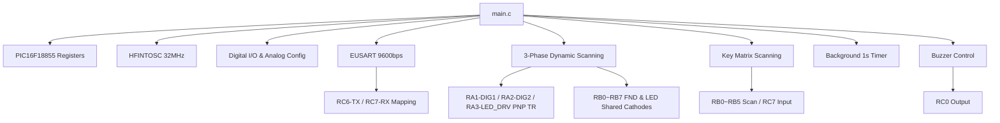

# 심부발열기 디스플레이 보드 제어 프로젝트 의존성 지도 (Dependency Map)

본 문서는 심부발열기 디스플레이 보드 제어 프로젝트의 소스 코드 파일 구성과 모듈 간 연관성을 기록하여, 향후 코드 수정 시 발생할 수 있는 부작용을 사전에 파악할 수 있도록 돕습니다.

## 파일 목록 및 역할

- [main.c](file:///d:/Work/Pic/Model/DeepHeater/main.c): 시스템 초기화(클럭, ANSEL, TRIS, LAT) 설정 및 메인 제어 루프(디스플레이 동적 스캔, 키 스캔, 부저 제어) 담당.
- [karpathy_guidelines.md](file:///d:/Work/Pic/Model/DeepHeater/karpathy_guidelines.md): 코딩 시 오버엔지니어링 방지 및 무결성 확보를 위한 가이드라인.
- [graphify_guide.md](file:///d:/Work/Pic/Model/DeepHeater/graphify_guide.md): 대화형 지식 그래프 및 시스템 분석 보고서 생성 도구 사용 매뉴얼.

## 모듈 간 연관성 (Dependency Map)

### 상세 파일별 의존성 및 주의사항

#### 1. [main.c](file:///d:/Work/Pic/Model/DeepHeater/main.c)
- **설명**: 프로젝트의 진입점(Entry Point) 및 주변장치 초기화.
- **의존성**:
  - `xc.h`: PIC16F18855 MCU용 컴파일러 라이브러리 및 레지스터 정의.
  - `stdio.h`: 표준 입출력 스트림(printf) 연동을 위한 헤더.
- **수정 시 주의사항**:
  - 클럭 주파수(`_XTAL_FREQ`) 변경 시 지연 함수 `__delay_ms()`의 실제 동작 주기뿐만 아니라, `UART_Init()` 내부의 보오율 설정 공식(SPBRG 값)도 함께 수정해야 하므로 매우 유의해야 합니다.
  - 디스플레이 및 LED 구동을 위한 TR 구동 핀(DIGIT 1, DIGIT 2, LED DRV, LED UV)은 모두 PNP TR 타입으로, `LOW(0)`일 때 출력 활성화 및 `HIGH(1)`일 때 비활성화됩니다. 포트 출력 제어 시 로직 방향에 각별히 유의해야 합니다.
  - **3단계 동적 스캔**: FND 세그먼트 캐소드 라인(RB0~RB7)이 개별 레벨 LED(LED1~LED8)의 캐소드 라인과 물리적으로 공유되므로, FND 구동 슬롯과 LED 구동 슬롯을 완전히 분리하여 **우측 FND(1ms) -> 좌측 FND(1ms) -> 레벨 LED(1ms)** 순서로 순차 구동하는 3단계 스캔을 유지해야 잔상 및 LED 간섭 현상을 완전히 막을 수 있습니다.
  - FND 및 개별 LED 디스플레이 동적 스캔 제어 시, 이전 자릿수의 잔상이 번져 보이는 고스트 현상(Ghosting)을 방지하기 위해 각 자릿수를 활성화하기 전에 `LATB = 0xFF`를 통해 세그먼트 데이터를 일시적으로 소등해야 깨끗한 디스플레이가 표현됩니다. 또한, 하드웨어 PNP TR의 물리적인 차단(Turn-off) 반응 지연을 보장하기 위해 자릿수 스위칭 사이에 약 `50us` 동안 데드 타임(Dead Time) 딜레이를 부여해야 0, 2, 3 등 급격한 온/오프 세그먼트 변화 시 잔상이 완전히 억제됩니다.
  - EUSART1 수신 PPS 레지스터명은 PIC16F18855 헤더 파일 기준 `RXPPS`이며, 송신 PPS는 `RC6PPS` 등으로 각 포트 핀 지정 레지스터를 사용합니다. 핀 변경 시 맵 이름을 교차 검증해야 합니다.
  - **키 매트릭스 스캔 타이밍**: `Key_Scan()`은 FND 세그먼트가 완전히 소등되는 스캔 전환 데드 타임 영역에서 극도로 짧은 시간에 수행되어야 합니다. 그렇지 않으면 키 스캔 전압(`RB0`~`RB5` 스캔 구동)이 디스플레이 세그먼트에 영향을 주어 미세한 글리치나 플리커 현상이 화면에 나타날 수 있습니다.
  - **비동기 부저 구동 제어**: 부저 비프 소요 시간(100ms)을 대기하기 위해 `__delay_ms`를 직접 메인 루프에서 사용하면 디스플레이 동적 스캔 루프가 강제로 정지되므로, 반드시 메인 스캔 루프(약 3.2ms 소요) 회수를 카운팅하는 비동기 소프트웨어 타이머를 사용하여 부저를 끄고 켜야 디스플레이 무중단 구동이 보장됩니다.
  - **백그라운드 카운트다운 타이머**: 메인 루프의 딜레이(3단계 동적 스캔의 각 1ms 딜레이 및 데드타임 지연 등)를 기반으로 `tick_ms`를 누적하여 시간을 계측하므로, 메인 루프 내에 불필요한 동기식 딜레이 함수가 추가될 경우 전체 타이머 속도가 크게 느려질 수 있으므로 비동기 제어 방식을 항상 지켜야 합니다.
  - **키 오토 리피트 (Auto-Repeat)**: 꾹 누르는 동작을 감지하기 위한 홀드 카운터(`key_hold_count`, `key_repeat_count`)가 각 키의 상태와 결합되어 있습니다. 디바운스 대기(`key_db_count`) 이후 약 500ms(150회 루프) 동안 꾹 누르면 그 뒤 100ms(30회 루프) 주기로 반복 입력되도록 타이밍이 최적화되어 있습니다.
  - **FND 대기 점멸 (Idle Blinking)**: 대기 상태(`is_running == 0`)일 때 500ms(150회 루프) 주기로 FND 소등 플래그(`blink_state`)를 반전시킵니다. FND 출력 시 `blink_state`가 0일 때 공통 애노드 제어 핀(LATA1, LATA2)을 비활성화하여 자연스러운 점멸을 유도합니다. 이 제어는 실행 중에는 강제로 활성화되어 점멸하지 않습니다.

