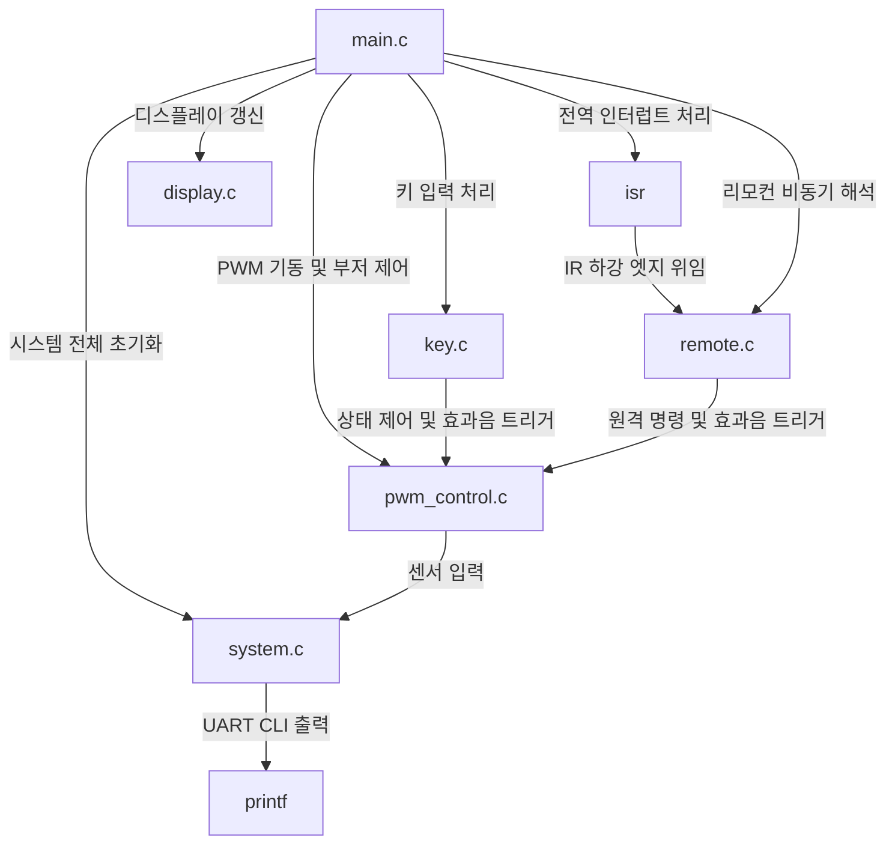

# 심부발열기 디스플레이 보드 제어 프로젝트 의존성 지도 (Dependency Map)

본 문서는 `main.c` 단일 파일에서 모듈러 아키텍처로 분할 리팩토링된 심부발열기 디스플레이 보드 제어 프로젝트의 파일 구성과 모듈 간 연관성을 기록하여, 향후 코드 수정 시 발생할 수 있는 부작용을 사전에 파악할 수 있도록 돕습니다.

## 파일 목록 및 역할

- [main.c](file:///d:/Work/Pic/Model/DeepHeater/main.c): 프로젝트의 진입점(Entry Point), 전역 상태 변수 관리, 메인 제어 루프 및 전역 인터럽트 서비스 루틴(ISR) 관리.
- [main.h](file:///d:/Work/Pic/Model/DeepHeater/main.h): 메인 전역 상태 플래그 및 주파수 정의 헤더.
- [system.c](file:///d:/Work/Pic/Model/DeepHeater/system.c) / [system.h](file:///d:/Work/Pic/Model/DeepHeater/system.h): 시스템 클럭(HFINTOSC 32MHz), GPIO 핀 방향/아날로그 설정, ADC 드라이버, 비동기 인터럽트 기반 UART CLI 통신 드라이버.
- [display.c](file:///d:/Work/Pic/Model/DeepHeater/display.c) / [display.h](file:///d:/Work/Pic/Model/DeepHeater/display.h): 3단계 동적 멀티플렉싱 스캔(우측 FND -> 좌측 FND -> LED) 및 데드타임을 적용한 고스트 현상 방지 FND 구동부.
- [key.c](file:///d:/Work/Pic/Model/DeepHeater/key.c) / [key.h](file:///d:/Work/Pic/Model/DeepHeater/key.h): FND 세그먼트 출력 핀 공유 키 매트릭스 스캔, 디바운싱(30ms), 꾹 누름 자동 감지(Auto-Repeat) 필터링.
- [pwm_control.c](file:///d:/Work/Pic/Model/DeepHeater/pwm_control.c) / [pwm_control.h](file:///d:/Work/Pic/Model/DeepHeater/pwm_control.h): 히터 PWM 설정(PWM6/7), 피드백 기반 풋 센서 AD 입력 모니터링, 수동 피에조 부저 가변 효과음 비동기 넌블로킹 연주부.
- [remote.c](file:///d:/Work/Pic/Model/DeepHeater/remote.c) / [remote.h](file:///d:/Work/Pic/Model/DeepHeater/remote.h): IOC 핀 인터럽트 연동 NEC 적외선 리모컨 비트 분석 디코더 상태 머신 및 커맨드 실행기.

---

## 모듈 간 연관성 (Dependency Map)

---

## 상세 모듈별 주의사항

### 1. [main.c](file:///d:/Work/Pic/Model/DeepHeater/main.c) / [main.h](file:///d:/Work/Pic/Model/DeepHeater/main.h)
- PIC16F 아키텍처 상 전역 인터럽트 서비스 루틴(`__interrupt() isr(void)`)은 중복 정의될 수 없으므로 `main.c`에만 정의되어 있습니다.
- IOC 인터럽트 플래그가 세워지면 `remote.c` 내의 `IR_Decode_Process()` 상태 머신을 호출하여 수신 시간 계측을 처리합니다.

### 2. [system.c](file:///d:/Work/Pic/Model/DeepHeater/system.c) / [system.h](file:///d:/Work/Pic/Model/DeepHeater/system.h)
- MCU의 오실레이터 주파수는 `32MHz`로 설정되어 있으며, 이 값이 변경될 경우 UART 보오율 설정 및 `__delay_ms()`의 물리 시간 축이 모두 변하므로 주의해야 합니다.
- 넌블로킹 UART 통신을 위해 TX 인터럽트를 사용하여, `printf`가 FND 디스플레이 스캔 루프를 멈추는(Blinking Glitch) 것을 원천 방지합니다.

### 3. [display.c](file:///d:/Work/Pic/Model/DeepHeater/display.c) / [display.h](file:///d:/Work/Pic/Model/DeepHeater/display.h)
- FND 세그먼트와 강도 표시 LED의 캐소드 라인이 공유되므로, **우측 FND(1ms) -> 좌측 FND(1ms) -> 레벨 LED(1ms)** 순서로 정밀한 3단계 스캔 시퀀스를 유지해야 합니다.
- 고스트 현상을 막기 위해 채널 교체 전 `LATB = 0xFF`로 세그먼트를 끄고, 하드웨어 TR 오프 지연 속도를 확보하기 위해 약 `50us`의 데드 타임(Dead Time) 딜레이를 무조건 유지해야 합니다.

### 4. [key.c](file:///d:/Work/Pic/Model/DeepHeater/key.c) / [key.h](file:///d:/Work/Pic/Model/DeepHeater/key.h)
- FND 구동 세그먼트 포트를 스캔 출력으로 공유하므로 디스플레이 스캔의 데드 타임 영역 내에서 빠르게 키 상태를 판독(`Key_Scan()`)합니다.
- 키가 눌렸을 때 치료 런타임 값(`minute`, `second`)을 조작하며 변경음 출력을 위해 `pwm_control.c` 내의 부저 상태 레지스터에 비동기 피치를 기록합니다.

### 5. [pwm_control.c](file:///d:/Work/Pic/Model/DeepHeater/pwm_control.c) / [pwm_control.h](file:///d:/Work/Pic/Model/DeepHeater/pwm_control.h)
- 치료 중인 경우 `Heater_Feedback_Process()`가 `system.c` 내의 아날로그 전압 판독 함수 `ADC_Read(0)`를 호출하여 풋 센서 과열을 실시간 모니터링합니다.
- 부저 효과음 재생 시 동기식 `__delay_ms`를 쓰면 동적 스캔이 멈추기 때문에, 비동기 소프트웨어 타이머 감쇄 방식(`Buzzer_Process()`)을 적용하여 FND 화면이 깜빡이지 않고 소리가 나도록 제어합니다.

### 6. [remote.c](file:///d:/Work/Pic/Model/DeepHeater/remote.c) / [remote.h](file:///d:/Work/Pic/Model/DeepHeater/remote.h)
- IR 센서 신호의 하강 엣지 간격(Interval)을 마이크로초 타이머로 측정하여 NEC 적외선 리모컨 비트열을 실시간 해독합니다.
- 해독된 명령 실행 시 `main.c`에 선언된 시간 플래그 및 치료 모드를 갱신하고, 피드백 부저 멜로디를 기동합니다.
